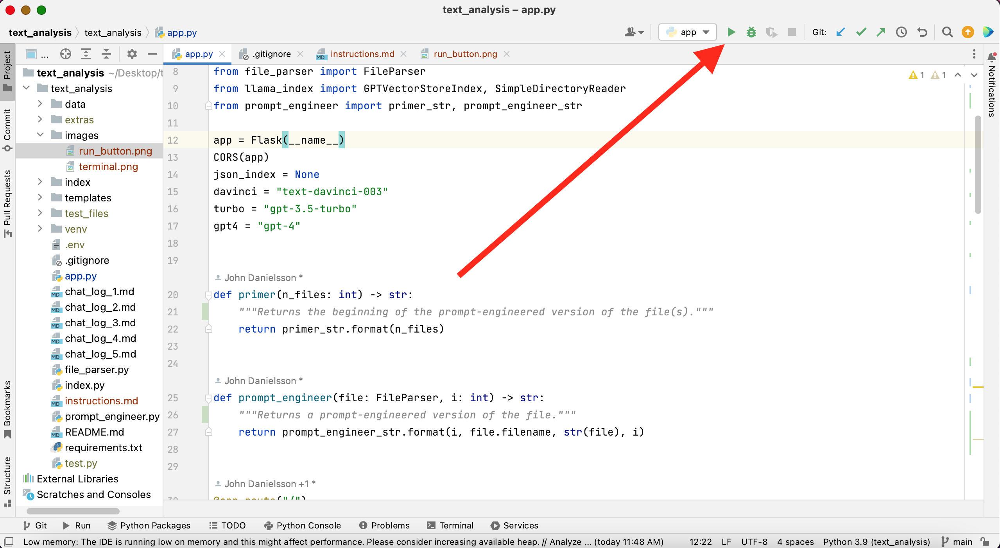
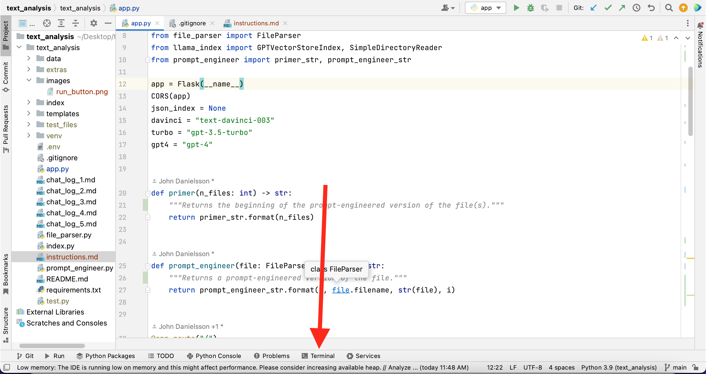
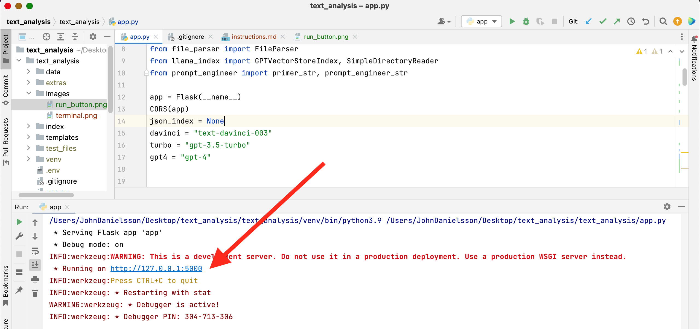
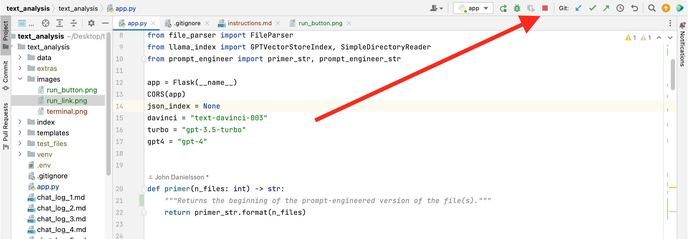

# INSTRUCTIONS

1) Navigate to the folder called ```text_analysis```.

2) In the ```text_analysis``` folder, open the file ```app.py``` in PyCharm.

3) In Pycharm, click on the green arrow in the upper right corner.



4) Click on "Terminal" (it may already be open).



5) Click on this link: [http://127.0.0.1:5000](http://127.0.0.1:5000) (you can also click in the terminal as shown below)



6) Upload files and answer questions as desired.

7) When you want to stop the app, you can either click the red square (just to the left of the green arrow) or close PyCharm.

